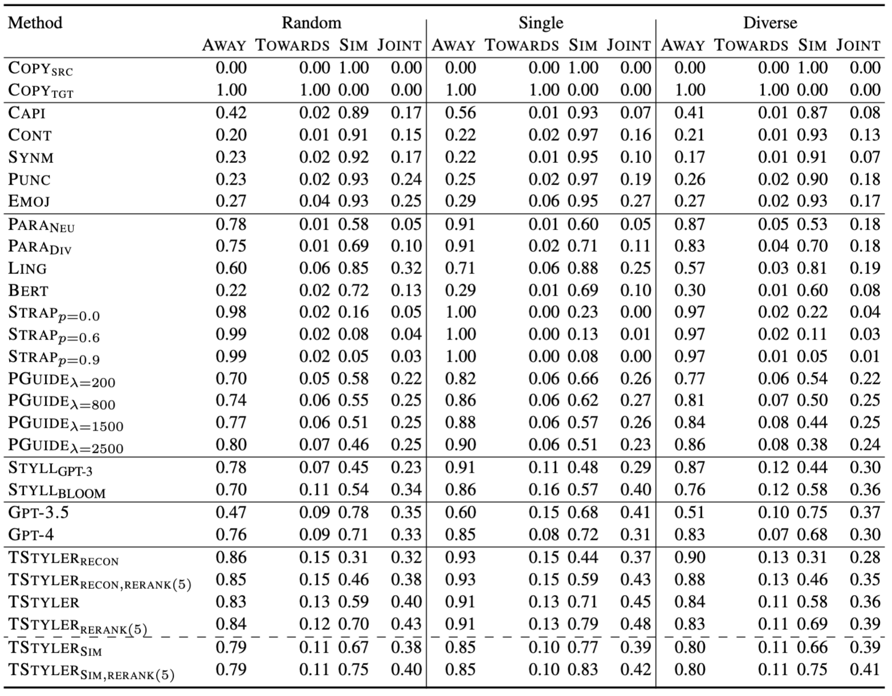

---

## License

This project is licensed under the MIT License.

---

<table>
  <tr>
    <td></td>
    <td style="vertical-align: middle;"><h1>TinyStyler</h1>
      TinyStyler is an efficient model for few-shot text style transfer. With only a few sample texts in the desired style, TinyStyler can transform any source text to match that style while preserving its original meaning.
    </td>
  </tr>
</table>


<div align="center">
  
[](https://aclanthology.org/2024.findings-emnlp.781/) [](https://huggingface.co/tinystyler/tinystyler)

</div>


## Overview

TinyStyler uses small language models (800M Parameters) combined with authorship representations (Wegmann et al., 2022; Rivera-Soto et al., 2021) that aim to capture the writing style of an author.  The model is first trained in an unsupervised fashion over a large corpus of texts to perform reconstruction from paraphrases by conditioning on an authorship embedding of the original text. At inference time, few-shot style transfer can be performed by conditioning on the authorship embedding of a new, desired target style. We further improve model performance by sampling a large number of transferred texts, filtering these texts using automatic metrics, and fine-tuning on the resulting high-quality pairs. The resulting approach enables simple, few-shot style transfer that is both on par with state-of-theart LLMs for short texts and offers fine-grained control through interpolation of the target style embedding.

Check out our [model demo](https://huggingface.co/spaces/tinystyler/tinystyler_demo)!

<div align="center">
  <a href="https://arxiv.org/abs/2406.15586" target="_blank">
    
  </a>
</div>


## Installation

Minimal inference dependencies:
```bash
pip install -e .
```

For training, data generation, and evaluation:
```bash
pip install -r requirements.txt
```

TinyStyler model checkpoints can be downloaded (using ``gdown``) with:
``` bash
cd ../models
chmod +x download.sh
./download.sh
```


## Structure

- [**authorship_evaluation**](./authorship_evaluation): Contains code for evaluating authorship transfer.

- [**data**](./data): Dataset preprocessing and generation logic. Also includes the authorship evaluation data.

- [**generation**](./generation): Simple generation script with examples.

- [**hugging_face_demo**](./hugging_face_demo): Logic for our Hugging Face demo, which include generation + reranking logic and examples.

- [**models**](./models): Model checkpoint download script.

- [**tinystyler**](./tinystyler): Source folder containing code for the "tinystyler" package.

- [**training**](./training): Contains scripts for training both the reconstruction and fine-tuned self-distilled model.


## Models

- The weights for TinyStyler models are [here](https://drive.google.com/drive/folders/1ThlK2oeBBaclWGEX5eb9fJeaZ4Oo53z9?usp=sharing). This model is fine-tuned on ~40K examples filtered from 160K authorship transfers generated with the reconstruction approach.
- We also release a second model, TinyStyler<sub>Sim</sub>. This model is fine-tuned on ~33K examples filtered from 500K author transfers with a higher meaning threshold (0.85 vs 0.70).


TinyStyler is also available on [Hugging Face](https://huggingface.co/tinystyler/tinystyler).

Additionally, our initial TinyStyler reconstruction model checkpoint is also available, under ``tinystyler_recon``.


<div align="center">
  <a href="https://arxiv.org/abs/2406.15586" target="_blank">
    
  </a>
</div>


## Citation

Please cite our work if you find TinyStyler useful in your research:

```bibtex
@inproceedings{horvitz-etal-2024-tinystyler,
    title = "{T}iny{S}tyler: Efficient Few-Shot Text Style Transfer with Authorship Embeddings",
    author = "Horvitz, Zachary  and
      Patel, Ajay  and
      Singh, Kanishk  and
      Callison-Burch, Chris  and
      McKeown, Kathleen  and
      Yu, Zhou",
    editor = "Al-Onaizan, Yaser  and
      Bansal, Mohit  and
      Chen, Yun-Nung",
    booktitle = "Findings of the Association for Computational Linguistics: EMNLP 2024",
    month = nov,
    year = "2024",
    address = "Miami, Florida, USA",
    publisher = "Association for Computational Linguistics",
    url = "https://aclanthology.org/2024.findings-emnlp.781",
    pages = "13376--13390",
    abstract = "The goal of text style transfer is to transform the style of texts while preserving their original meaning, often with only a few examples of the target style. Existing style transfer methods generally rely on the few-shot capabilities of large language models or on complex controllable text generation approaches that are inefficient and underperform on fluency metrics. We introduce TinyStyler, a lightweight but effective approach, which leverages a small language model (800M params) and pre-trained authorship embeddings to perform efficient, few-shot text style transfer. We evaluate on the challenging task of authorship style transfer and find TinyStyler outperforms strong approaches such as GPT-4. We also evaluate TinyStyler{'}s ability to perform text attribute style transfer (formal $\leftrightarrow$ informal) with automatic and human evaluations and find that the approach outperforms recent controllable text generation methods.",
}
```

### Funding Acknowledgments

This research was funded in part by the Office of the Director of National Intelligence (ODNI), through the Intelligence Advanced Research Projects Activity (IARPA), via the HIATUS Program, contract #2022-22072200005. The views and conclusions expressed are those of the authors and do not necessarily represent the official policies of ODNI, IARPA, or the U.S. Government. The U.S. Government retains rights to reproduce and distribute reprints for governmental use. Additional support was provided by a Fellowship from the Columbia Center of AI Technology.
