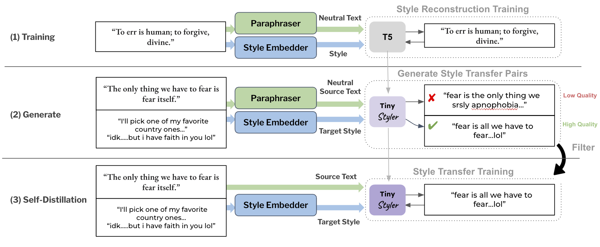

# Data Generation Scripts

This folder contains the logic for generating data for both *training the initial reconstruciton model* (Step 1) and for generating and filtering the supervised data (Step 2). We also include the the evaluation dataset from Patel et al., 2022, used for the authorship transfer task.

## Scripts

- [build_stage_1.sh](build_stage_1.sh): Takes a `.jsonl` file with a list of texts for each author and builds the reconstruction training data (paraphrases + style embeddings). The result is a Hugging Face dataset.

- [build_stage_2.sh](train_stage_3.sh): Uses the processed data from [build_stage_1.sh](build_stage_1.sh) to sample pairs of authors. Then, this approach using the reconstruction model to generate multiple outputs, and filters these results.

See these files for information on the intermediate steps in each stage.

## Example Authorship Dataset

The Data from Million Reddit User Dataset (MUD) is behind an access form: https://docs.google.com/forms/d/e/1FAIpQLSesc-0HI2DRYjFqlpPo2hTh9OJ53jtWjYQiIfAtmzSVUCxiLA/viewform

As a result, we have provided an example dummy authorship dataset [data.jsonl](example_authorship_dataset/data.jsonl) file in the [example_authorship_dataset](example_authorship_dataset) folder. You may replace this with **your own dataset** or the MUD dataset.

## Styll Evaluation Data

[styll_evaluation_data](styll_evaluation_data/) contains the evaluation data from *Low-Resource Authorship Style Transfer: Can Non-Famous Authors Be Imitated?* (Patel et al., 2022) (https://arxiv.org/pdf/2212.08986).
