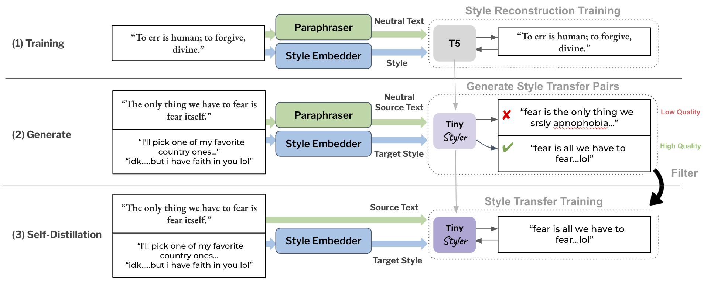

# Training Scripts

This folder contains TinyStyler (and TinyStyler reconstruction) training logic.

  

## Structure

- [train_stage_1.sh](train_stage_1.sh): Trains reconstruction model to reconstruct texts from paraphrases and authorship embeddings (Step 1 in Figure 2).

- [train_stage_3.sh](train_stage_3.sh): Fine-tune/Self-distill the reconstruction model on filtered supervised data (Step 3 in Figure 2).

- [train.py](train.py): Contains training logic shared between these steps. We train our models on a single GPU. However, this script supports DDP with Accelerate. Metrics are logged with WandB.

